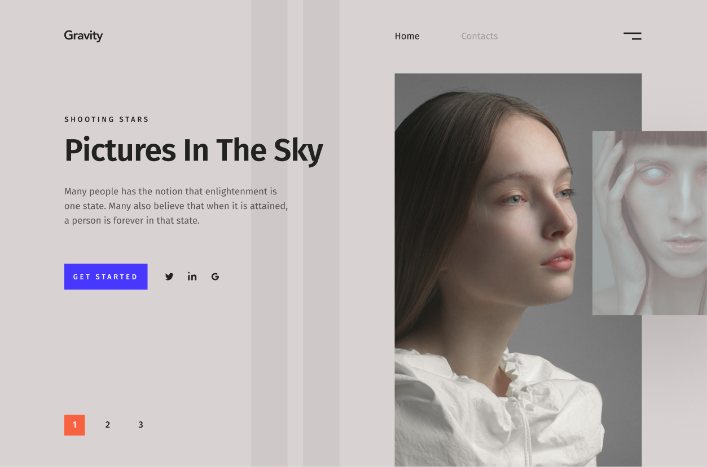

# Проект «Gravity»

* Вёрстка: [Алёна Стасенко](https://github.com/KudriPro).
* Макет: [Out of Cloud](https://outofcloud.ru/).

## Описание
> Тестовый проект для компании Out of Cloud
---

* Используемые технологии: _HTML, CSS, БЭМ_.
* Автоматизация: _Gulp_.
* Фреймворки: _нет_
* Препроцессоры: _LESS_

## Ссылки 

<table>
  <tr>
  <th><a href="https://kudripro.github.io/Gravity/">Главная страница 1360px</a></th>
  </tr>
  <tr valign="top">
    <td>
      
    </td>
  </tr>
</table>
